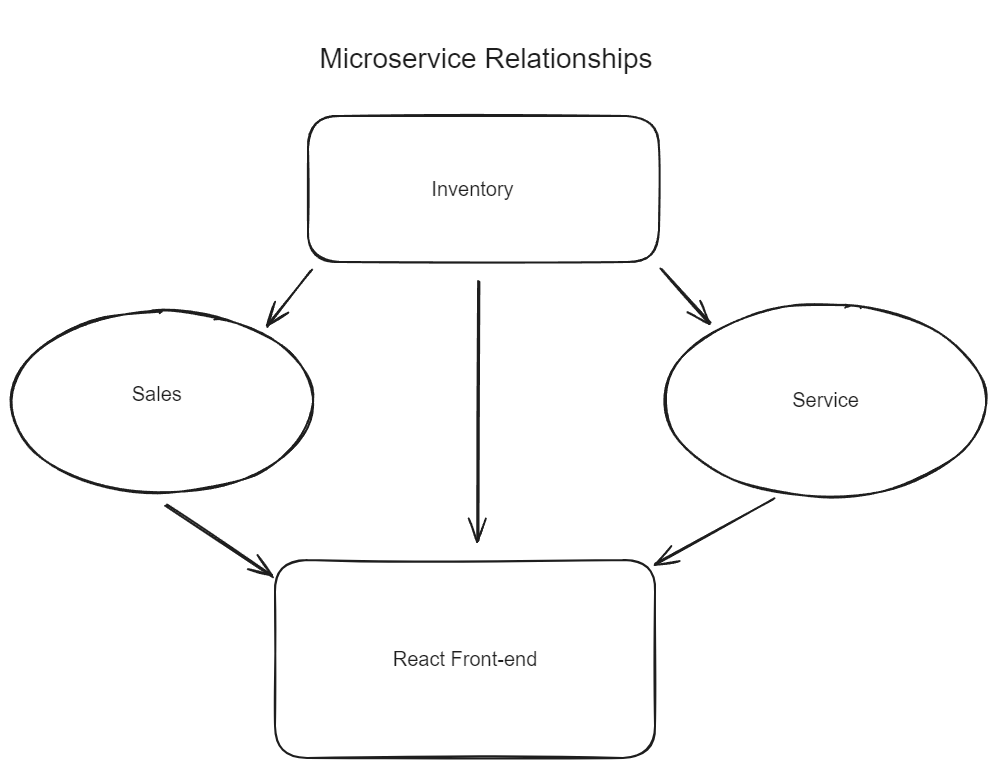

# CarCar

CarCar is an application designed, to assit you in managing the day to day of a Car Dealership. It can manage a team of salepeople and technicians, an inventory of automibiles, and the schedule of the service sides automobile maintenance appointments.

Team:

* James Keyser - Service
* Jaron Laquindanum - Sales

## How to Run this App
1. Fork this repository

2. Clone the forked repository to your local machine.
    git clone <<repositoryURLhere>>

3. Run these commands
    - docker-volume create beta-data
    - docker-compose build
    - docker-compose up

4. After you run docker compose up the application can be reached at
   - `http://localhost:3000/`

## Design
Below is a diagram of the relationship between the different microservices

## API Documentation
1. There is an inventory, service, and sales API with Restfull endpoints.

2. The Inventory API can add a vehicle, a vehicle model, and manufacturer. It will also track
inventory of the dealerships available vehicles.

## Service microservice

The Service API allows the user to create and track vehicle maintenance appointments. It also will track the status of the appointments as pending, canceled, or finished. It has the ability to add a new technician and track which appointments that technician is assigned to work. There is a special feature that will track the vin of a vehicle and if it was sold by the dealership appoinments on those vehicles will be VIP status. Lastly it has a service history that track every appoinment that has gone through the system.

## Sales microservice

The Sales API allows the user to create and track Salespeople, customers, sales, and the sale history. It will keep record of automobile sales that come from the inventory, containing the price, vin, customer, and salesperson. A customer can not sell cars that are not within the listed inventory. They can not sell a car that had already been sold before. The special feature shows automobiles available for sale from the inventory and they will be marked as unsold. It will detect automobiles that have already been sold.

### URLs and Ports
You can access the api endpoint with the following urls.
Inventory API
    `http://localhost:8100/`

Manufacturers
-List Manufacturers
    `http://localhost:8100/api/manufacturers/`
-Create Manufacturer
    `http://localhost:8100/api/manufacturers/`
-Get a Specific Manufacturer
    `http://localhost:8100/api/manufacturers/:id/`
-Update a Specific Manufacturer
    `http://localhost:8100/api/manufacturers/:id/`
-Delete a Specific Manufacturer
    `http://localhost:8100/api/manufacturers/:id/`

Vehicle Models
-List Vehicle Models
    `http://localhost:8100/api/models/`
-Create a Vehicle Model
    `http://localhost:8100/api/models/`
-Get a Specific Vehicle Model
    `http://localhost:8100/api/models/:id/`
-Update a Specific Vehicle Model
    `http://localhost:8100/api/models/:id/`
-Delete a Specific Vehicle MOdel
    `http://localhost:8100/api/models/:id/`

Vehicles in Inventory
-List Vehicles
    `http://localhost:8100/api/automobiles/`
-Create Vehicle
    `http://localhost:8100/api/automobiles/`
-Get a Specific Vehicle
    `http://localhost:8100/api/automobiles/:vin/`
-Update a Specific Vehicle
    `http://localhost:8100/api/automobiles/:vin/`
-Delete a Specific Vehicle
    `http://localhost:8100/api/automobiles/:vin/`

Service
 -List Technicians
    `http://localhost:8080/api/technicians/`
 -Create Technician
    `http://localhost:8080/api/technicians/`
 -Delete a Specific Technician
    `http://localhost:8080/api/technicians/:id/`
 -List Appointments
    `http://localhost:8080/api/appointments/`
 -Create an Appointment
    `http://localhost:8080/api/appointments/`
 -Delete an Appointment
    `http://localhost:8080/api/appointments/:id/`
 -Set Appointment Status to Canceled
    `http://localhost:8080/api/appointments/:id/cancel/`
 -Set Appointment Status to Finished
    `http://localhost:8080/api/appointments/:id/finish/`

Sales
 -List salespeople
    `http://localhost:8090/api/salespeople/`
 -Create a salesperson
    `http://localhost:8090/api/salespeople/`
 -Delete a salesperson
    `http://localhost:8090/api/salespeople/:id/`
 -List Customers
    `http://localhost:8090/api/customers/`
 -Create a customer
    `http://localhost:8090/api/customers/`
 -Delete a customer
    `http://localhost:8090/api/customers/:id/`
 -List sales
    `http://localhost:8090/api/sales/`
 -Create a sale
    `http://localhost:8090/api/sales/`
 -Delete a sale
    `http://localhost:8090/api/sales/:id`

